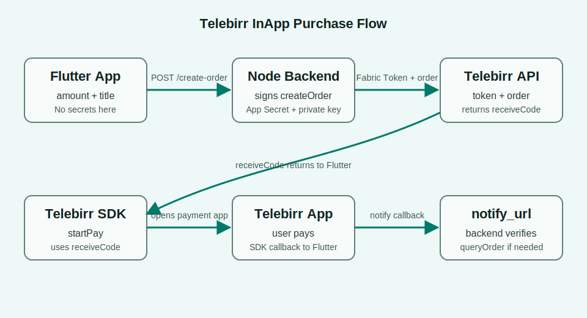

# telebirr_plus

`telebirr_plus` is a simple Node.js backend package and local test website for Telebirr InApp Purchase.

It is designed to work with the Flutter package:

- pub.dev: [telebirr_inapp_purchase_plus](https://pub.dev/packages/telebirr_inapp_purchase_plus)
- GitHub: [Dream-Technologies-PLC/telebirr_inapp_purchase_plus](https://github.com/Dream-Technologies-PLC/telebirr_inapp_purchase_plus)

Use this Node package for the backend part. Use the Flutter package for opening the native Telebirr payment SDK.

## Full Flow



1. Customer opens your Flutter app.
2. Flutter sends `title` and `amount` to your backend.
3. Backend calls Telebirr Apply Fabric Token.
4. Backend signs and calls Telebirr Create InApp Order.
5. Backend returns `receiveCode` to Flutter.
6. Flutter calls `TelebirrInAppPurchasePlus.startPay(...)` with that `receiveCode`.
7. Telebirr app opens and customer pays.
8. Flutter receives SDK callback.
9. Telebirr calls your backend `notify_url`.
10. Backend can call `queryOrder` to confirm the final payment status.

## Important Security Rule

Keep these only on your backend:

- App Secret
- Private key
- Fabric Token logic
- createOrder logic
- queryOrder logic
- notify_url verification

Flutter must only receive `receiveCode`.

## Before You Start

1. Create an account at [developer.ethiotelecom.et](https://developer.ethiotelecom.et/).
2. Create or join your organization/team at [developer.ethiotelecom.et/user/team](https://developer.ethiotelecom.et/user/team).
3. Make sure the organization member status is approved.
4. Make sure your Telebirr product/contract is approved for InApp payment.
5. Get these credentials from the portal:

- Fabric App ID
- Merchant App ID
- Business Short Code
- App Secret
- Private key

If your organization or contract is not approved, Telebirr may return:

```text
60200098: Product is not subscribed or the contract status is not allowed to do this operation.
```

## Install Backend

You can test in two ways:

- Run the included example website first.
- Install `telebirr_plus` inside your own Node/Express backend.

## Option 1: Run The Included Example Website

Clone this repository:

```bash
git clone https://github.com/Dream-Technologies-PLC/telebirr_plus.git
cd telebirr_plus
npm install
```

Create `.env`:

```bash
cp .env.example .env
mkdir -p keys
```

Put your Telebirr private key here:

```text
keys/private_key.pem
```

Fill `.env`:

```env
PORT=3000
TELEBIRR_ENV=test
TELEBIRR_FABRIC_APP_ID=your_fabric_app_id
TELEBIRR_APP_SECRET=your_app_secret
TELEBIRR_MERCHANT_APP_ID=your_merchant_app_id
TELEBIRR_SHORT_CODE=your_business_short_code
TELEBIRR_PRIVATE_KEY_PATH=./keys/private_key.pem
TELEBIRR_NOTIFY_URL=https://yourdomain.com/api/telebirr/notify
TELEBIRR_TIMEOUT=120m
TELEBIRR_PAYEE_TYPE=3000
TELEBIRR_VERIFY_SSL=true
```

Start the example:

```bash
npm start
```

Open the test website:

```text
http://localhost:3000
```

Test with cURL:

```bash
curl -X POST http://localhost:3000/api/telebirr/create-order \
  -H "Content-Type: application/json" \
  -d '{
    "title": "Local test order",
    "amount": "12.00"
  }'
```

The response gives you `receiveCode`. Copy it into the Flutter package example app and press **Pay With Telebirr**.

## Option 2: Use In Your Own Node Project

Create a Node project:

```bash
mkdir telebirr-backend
cd telebirr-backend
npm init -y
npm install telebirr_plus express cors dotenv
```

Create folders:

```bash
mkdir keys
```

Put your private key here:

```text
keys/private_key.pem
```

Create `.env`:

```env
PORT=3000
TELEBIRR_ENV=test
TELEBIRR_BASE_URL=
TELEBIRR_FABRIC_APP_ID=your_fabric_app_id
TELEBIRR_APP_SECRET=your_app_secret
TELEBIRR_MERCHANT_APP_ID=your_merchant_app_id
TELEBIRR_SHORT_CODE=your_business_short_code
TELEBIRR_PRIVATE_KEY_PATH=./keys/private_key.pem
TELEBIRR_NOTIFY_URL=https://yourdomain.com/api/telebirr/notify
TELEBIRR_TIMEOUT=120m
TELEBIRR_PAYEE_TYPE=3000
TELEBIRR_VERIFY_SSL=true
```

For local Telebirr testbed only, if your machine rejects the Telebirr testbed certificate, use:

```env
TELEBIRR_VERIFY_SSL=false
```

Keep `TELEBIRR_VERIFY_SSL=true` in production.

## Create Backend Server

Create `server.js`:

```js
require('dotenv').config();

const cors = require('cors');
const express = require('express');
const {
  TelebirrInAppClient,
  createTelebirrRouter,
  loadConfigFromEnv,
} = require('telebirr_plus');

const app = express();
const client = new TelebirrInAppClient(loadConfigFromEnv());

app.use(cors());
app.use(express.json());

app.use('/api/telebirr', createTelebirrRouter(client, {
  onNotify: async (payload) => {
    console.log('Telebirr notify_url payload:', payload);
  },
}));

app.listen(3000, () => {
  console.log('Telebirr backend running on http://localhost:3000');
});
```

Run:

```bash
node server.js
```

Your backend create-order URL is:

```text
http://localhost:3000/api/telebirr/create-order
```

Test your own project with cURL:

```bash
curl -X POST http://localhost:3000/api/telebirr/create-order \
  -H "Content-Type: application/json" \
  -d '{
    "title": "Peace Ride test order",
    "amount": "12.00"
  }'
```

Successful response:

```json
{
  "success": true,
  "code": "0",
  "message": "Order created.",
  "merchantOrderId": "1778088977616",
  "receiveCode": "TELEBIRR$BUYGOODS$772770$12.00$02412b73e0654fcf466578ffe5d3153c47a003$120m",
  "raw": {}
}
```

Copy `receiveCode`. Flutter uses it to start payment.

## Use With Flutter

Install the Flutter app package:

```yaml
dependencies:
  telebirr_inapp_purchase_plus: ^0.0.3
```

Flutter code:

```dart
final request = TelebirrPaymentRequest(
  appId: 'YOUR_MERCHANT_APP_ID',
  shortCode: 'YOUR_SHORT_CODE',
  receiveCode: receiveCodeFromBackend,
  returnApp: 'yourappscheme',
  environment: TelebirrEnvironment.test,
);

final result = await TelebirrInAppPurchasePlus.startPay(request);

if (result.isSuccess) {
  print('Payment successful');
} else {
  print('Payment failed: ${result.message}');
}
```

The Flutter app fields should be:

- Backend create-order URL: `http://YOUR_BACKEND_HOST/api/telebirr/create-order`
- Merchant App ID: your portal Merchant App ID
- Short code: your Business Short Code
- Return app scheme: the scheme configured in your Flutter app
- Amount: order amount
- Title: order title

For a real phone on the same Wi-Fi, do not use `localhost` in Flutter. Use your computer IP:

```text
http://192.168.x.x:3000/api/telebirr/create-order
```

## Included Test Website

This package includes a local HTML test page.

Clone or open this package, then create `.env` from the example:

```bash
cp .env.example .env
mkdir -p keys
```

Add your private key:

```text
keys/private_key.pem
```

Run:

```bash
npm install
npm start
```

Open:

```text
http://localhost:3000
```

The page lets you:

- Create a Telebirr test order
- See the returned `merchantOrderId`
- Copy the `receiveCode`
- Copy a Flutter `TelebirrPaymentRequest` snippet

There is also a dedicated example env file:

```text
examples/express/.env.example
```

## Testbed And Production

Testbed:

```env
TELEBIRR_ENV=test
```

Production:

```env
TELEBIRR_ENV=production
```

In Flutter, match the same environment:

```dart
environment: TelebirrEnvironment.test
```

or:

```dart
environment: TelebirrEnvironment.production
```

Default Telebirr gateway URLs:

```text
Testbed:    https://developerportal.ethiotelebirr.et:38443/apiaccess/payment/gateway
Production: https://telebirrappcube.ethiomobilemoney.et:38443/apiaccess/payment/gateway
```

## API

### `TelebirrInAppClient`

```js
const client = new TelebirrInAppClient(loadConfigFromEnv());
```

Methods:

- `applyFabricToken()`
- `createOrder({ title, amount, merchantOrderId, notifyUrl, redirectUrl, callbackInfo })`
- `queryOrder({ merchantOrderId })`

### `createTelebirrRouter(clientOrConfig, options)`

Creates these routes:

- `POST /create-order`
- `POST /query-order`
- `POST /notify`

## Query Order

```bash
curl -X POST http://localhost:3000/api/telebirr/query-order \
  -H "Content-Type: application/json" \
  -d '{
    "merchantOrderId": "1778088977616"
  }'
```

Use `queryOrder` when:

- Flutter callback is delayed
- User closes the app after payment
- `notify_url` is delayed
- You need backend-side final confirmation

## Troubleshooting

### `60200098`

Your developer organization, product subscription, or contract is not approved.

Check:

- Developer account status
- Organization member status
- Product subscription
- Contract approval
- Correct Merchant App ID and Short Code

### `fetch failed`

For local testbed, try:

```env
TELEBIRR_VERIFY_SSL=false
```

Then restart Node.

### Flutter cannot call backend

If testing on a real phone, use your computer LAN IP instead of `localhost`.

Example:

```text
http://192.168.1.20:3000/api/telebirr/create-order
```

### Payment opens but final status is unclear

Use backend `notify_url` and `queryOrder`. The Flutter SDK callback is helpful for UI, but final payment confirmation should come from the backend.
